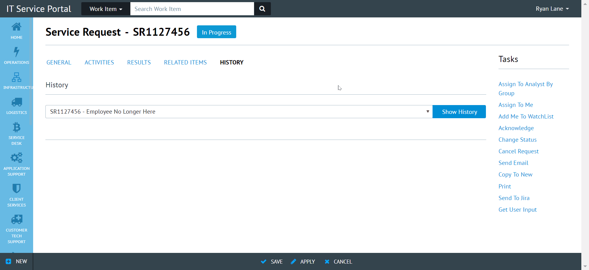

# History

A replacement for the History button with a dropdown for all related activities.



## Installing

There are several options for installing this customization.

### IIS Redirect

1. Copy [controller.js](controller.js) and [view.html](view.html) files to CustomSpace directory.

PSPath                                                                             | Location              |
---------------------------------------------------------------------------------- | --------------------- |
MACHINE/WEBROOT/APPHOST/CiresonPortal/CustomSpace/scripts/forms/predefined/history | view.html             |
MACHINE/WEBROOT/APPHOST/CiresonPortal/CustomSpace/scripts/forms/predefined/history | controller.js         |

2. Create IIS Redirect from original Cireson files to controller.js and view.html.

PSPath                                                                       | Location              | destination                                                       | exactDestination | httpResponseStatus
---------------------------------------------------------------------------- | --------------------- | ----------------------------------------------------------------- | ---------------- | ------------------
MACHINE/WEBROOT/APPHOST/CiresonPortal/scripts/forms/predefined/history       | view.html             | /CustomSpace/Scripts/forms/predefined/history/view.html           | False            | Permanent         
MACHINE/WEBROOT/APPHOST/CiresonPortal/scripts/forms/predefined/history       | controller.js         | /CustomSpace/Scripts/forms/predefined/history/controller.js       | False            | Permanent         

### RequireJS Redirect

1. Copy [controller.js](controller.js) and [view.html](view.html) files to CustomSpace directory

PSPath                                                                             | Location              |
---------------------------------------------------------------------------------- | --------------------- |
MACHINE/WEBROOT/APPHOST/CiresonPortal/CustomSpace/scripts/forms/predefined/history | view.html             |
MACHINE/WEBROOT/APPHOST/CiresonPortal/CustomSpace/scripts/forms/predefined/history | controller.js         |

2. Modify formBuilder.js with the custom path of [controller.js](controller.js)

PSPath                                                                       | Location              | Line |
---------------------------------------------------------------------------- | --------------------- | ---- |
MACHINE/WEBROOT/APPHOST/CiresonPortal/scripts/forms/                         | formBuilder.js        | 23   |

```javascript
    "CustomSpace/Scripts/forms/predefined/history/controller", // "forms/predefined/history/controller",
```

### File Replacement (Unrecommended)

1. Replace the original Cireson files with custom [controller.js](controller.js) and [view.html](view.html).

PSPath                                                                       | Location              |
---------------------------------------------------------------------------- | --------------------- |
MACHINE/WEBROOT/APPHOST/CiresonPortal/scripts/forms/predefined/history       | view.html             |
MACHINE/WEBROOT/APPHOST/CiresonPortal/scripts/forms/predefined/history       | controller.js         |

2. Modify [controller.js](controller.js) line 6 with the final patch of [view.html](view.html).

PSPath                                                                       | Location              | Line |
---------------------------------------------------------------------------- | --------------------- | ---- |
MACHINE/WEBROOT/APPHOST/CiresonPortal/scripts/forms/predefined/history       | controller.js         | 10   |

```javascript
    "text!CustomSpace/Scripts/forms/predefined/history/view.html"
```
 
